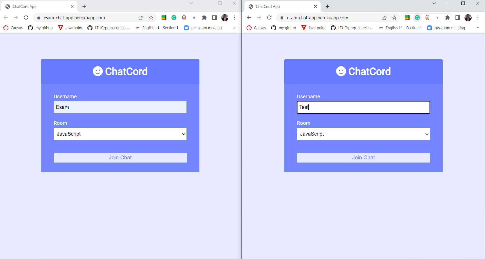
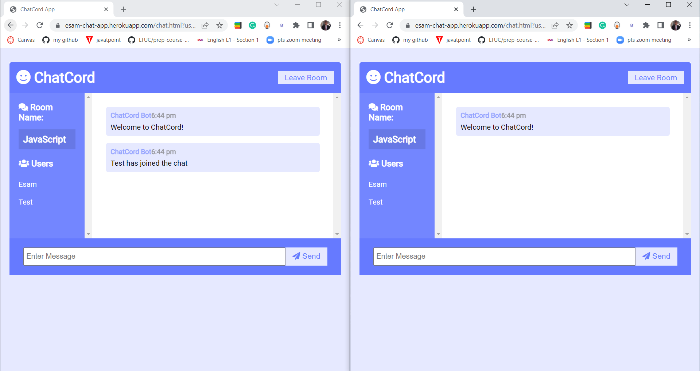
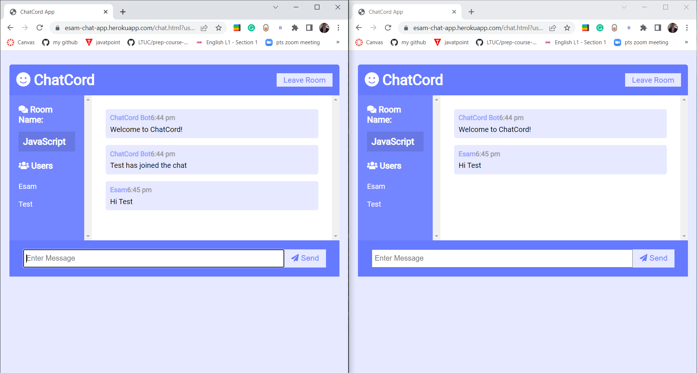
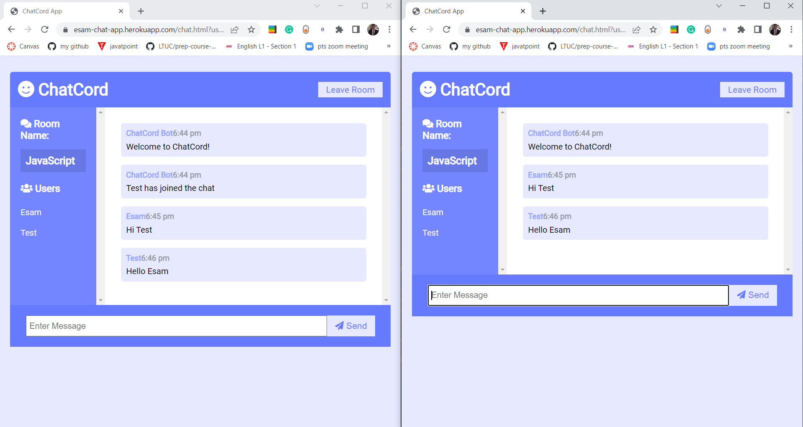
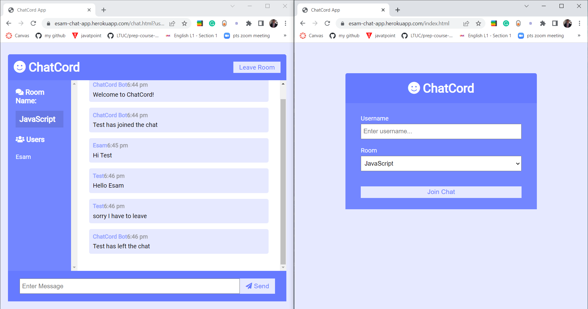
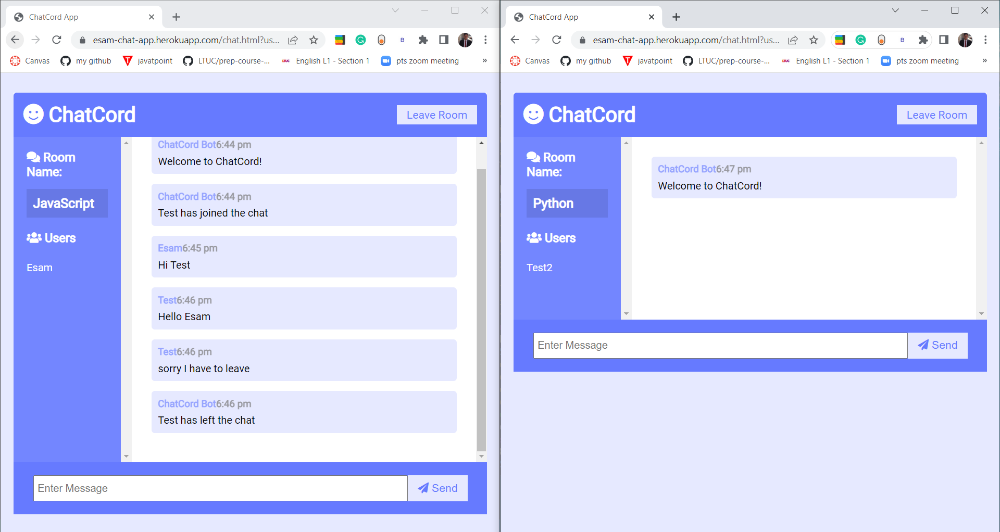

# Realtime-Chat-App
Realtime chat app with websockets using Node.js, Express and Socket.io with Vanilla JS on the frontend with a custom UI

[link to Heroku](https://esam-chat-app.herokuapp.com/)

